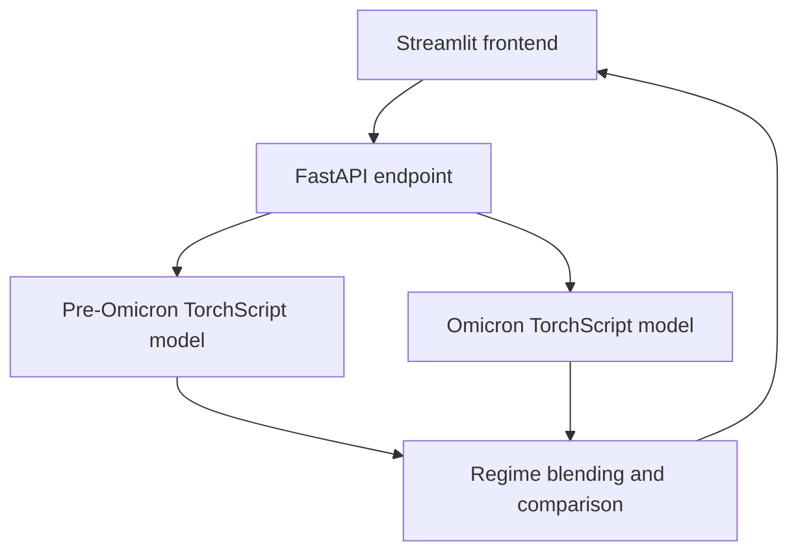

# COVID-19 Prevalence Forecasting App

A research prototype for **retrospective, multi-horizon probabilistic forecasting of weekly COVID-19 point prevalence** under user-defined policy *as-if* scenarios.

The application combines two regime-specific neural quantile models with a FastAPI inference service and a Streamlit exploration interface. It forecasts 12 weekly horizons and returns the 10th, 50th, and 90th conditional quantiles.

**Live application:** [covidprevalenceforecastingapp-production.up.railway.app](https://covidprevalenceforecastingapp-production.up.railway.app/)

The hosted Streamlit service may require a short cold-start period after inactivity.

> [!IMPORTANT]
> This project is not a real-time surveillance system, an early-warning system, a causal policy evaluation, or an operational decision-support tool. Its outputs are retrospective, model-conditional projections under explicit scenario assumptions.

## Contents

- [What the application does](#what-the-application-does)
- [Project scope](#project-scope)
- [Architecture](#architecture)
- [Data and temporal coverage](#data-and-temporal-coverage)
- [Forecasting approach](#forecasting-approach)
- [Policy scenarios and interpretation](#policy-scenarios-and-interpretation)
- [Regime selection and blending](#regime-selection-and-blending)
- [Frontend](#frontend)
- [API](#api)
- [Repository structure](#repository-structure)
- [Run locally](#run-locally)
- [Training and model artifacts](#training-and-model-artifacts)
- [Validation and reproducibility](#validation-and-reproducibility)
- [Limitations and engineering status](#limitations-and-engineering-status)
- [My contribution and use of generative AI](#my-contribution-and-use-of-generative-ai)
- [Documentation, citation, and license](#documentation-citation-and-license)

## What the application does

For a selected country and forecast anchor week, the application:

1. reads the shared global epidemiological and policy history available at the anchor;
2. accepts a future 12-week path for three normalized policy variables;
3. constructs the model's horizon-specific feature tensor;
4. generates separate Pre-Omicron and Omicron quantile forecasts where available;
5. combines both model outputs using automatic time-based or manually supplied weights;
6. returns a baseline-versus-scenario comparison together with recent observed history.

The model-native outputs are:

- **q10** — lower conditional quantile;
- **q50** — median conditional forecast;
- **q90** — upper conditional quantile;
- **12 direct horizons** — one through twelve weeks after the selected anchor.

The three quantiles form a probabilistic forecast summary. They are not confidence intervals for a causal treatment effect.

## Project scope

The prototype is designed for:

- retrospective analysis of country-level weekly prevalence trajectories;
- uncertainty-aware, direct multi-horizon forecasting;
- transparent comparison of an observed-policy baseline with an assumed future policy path;
- exploration of model behavior across Pre-Omicron and Omicron periods;
- inspection of methodological assumptions and epistemic limits.

It is deliberately not designed to:

- estimate or identify causal policy effects;
- infer what would have happened under an actual intervention;
- recommend public-health measures;
- ingest live surveillance data;
- issue alerts or support operational decisions.

## Architecture



The separation of responsibilities is explicit:

- the **frontend** collects scenario inputs, calls the API, and visualizes results;
- the **backend** validates request values and shape, builds model inputs from a shared global history, runs inference, blends outputs, and assembles the response;
- the **training notebooks** contain data preparation, optimization, regularization, model fitting, and artifact export;
- the **TorchScript artifacts** provide inference without retraining at runtime.

## Data and temporal coverage

The repository contains two processed, regime-specific weekly datasets:

| Regime | File | Date range | Local week index | Rows | Countries |
| --- | --- | --- | ---: | ---: | ---: |
| Pre-Omicron | `df_final_pre_omicron.csv` | 2020-03-01 to 2021-12-26 | 0–95 | 8,544 | 89 |
| Omicron | `df_final_omicron.csv` | 2022-01-02 to 2023-07-30 | 0–82 | 7,387 | 89 |

The API and both inference wrappers use a unified global week axis from **0 to 178**. Omicron local week 0 is mapped to global week 96. Both regime experts therefore receive features from the same country and global anchor. The Omicron wrapper translates only its centered time feature back to the local coordinate used during training.

The processed data originate from the related [Cross-National COVID-19 Risk and Policy Dataset](https://github.com/chhmaass/cross-national-covid-19-risk-policy-dataset-v1). Runtime inference uses the two included processed CSV files; it does not fetch external data.

The scenario interface uses three policy series, represented on the model's normalized `[0, 1]` scale:

1. policy stringency;
2. face-covering policy;
3. testing and tracing policy.

## Forecasting approach

### Direct horizon-aware quantile regression

Each regime is represented by a global feed-forward neural quantile regressor trained across countries and all 12 forecast horizons. A learned horizon embedding allows the same model to produce horizon-specific outputs without recursively feeding predictions back into the model.

The exported architecture uses:

- a 12-dimensional horizon embedding;
- a 27-feature continuous input contract;
- one hidden layer with 128 units;
- dropout;
- three quantile outputs per horizon.

The training notebooks use PyTorch, PyTorch Lightning, Optuna, pinball/quantile loss, early stopping, checkpointing, and learning-rate reduction on validation loss.

### Feature contract

The 27 inference features are organized as follows:

| Group | Features | Runtime behavior |
| --- | --- | --- |
| Epidemiological anchors | centered four-week prevalence mean and slope | calculated at the anchor and held constant across horizons |
| Time and geography | centered time, latitude | calculated from the selected regime and country |
| Seasonality | sine/cosine terms and latitude interactions | advanced from the observed seasonal phase at the anchor across all 12 horizons |
| Policy lags | lags 1–4 for each of the three policy series | present in the training contract but neutralized at serving time |
| Policy memory | exponentially weighted/Koyck windows with half-lives 6 and 12 | updated recursively from observed history and the future scenario path |
| Serving gate | `lag_gate` | set to zero during inference |

All model inputs are standardized using the included regime-specific training statistics.

### Ordered and bounded quantiles

The model constructs q50 and q90 as positive increments above the preceding quantile by using cumulative `Softplus` transformations. This structurally enforces:

```text
q10 <= q50 <= q90
```

The exported TorchScript wrapper applies a sigmoid transformation and scales outputs to the prevalence range `[0, 1]`.

## Policy scenarios and interpretation

Policy values define **assumed future paths**, not treatments with identified causal effects. The interface supports:

- a constant 12-week path;
- a linear transition from start to end values;
- manual weekly values for all 12 horizons.

For each request, the backend produces:

- a **baseline**, based on the observed future policy path in the processed data;
- a **scenario**, based on the user-supplied future path;
- the quantile-wise difference between scenario and baseline.

If fewer than 12 observed future policy rows remain, the baseline is padded with the final available policy triple. If no future row exists, the anchor-week policy values are repeated.

During training, the model is biased toward conservative policy sensitivity through lag gating, regularization, and capped monotonic constraints on the exponentially weighted policy features. At serving time, discrete policy lags and the gate are neutralized; scenario sensitivity is transmitted through the recursively updated exponentially weighted policy windows.

These structural restrictions improve behavioral discipline but **do not establish causal identification**. Policy variables may be endogenous, reactive to epidemic conditions, correlated with omitted factors, and measured with error.

## Regime selection and blending

The backend maintains separate Pre-Omicron and Omicron models. Both can be evaluated for the same global anchor using the shared history, while retaining their own weights, centering constants, and normalization statistics. Under automatic blending, weights depend on the unified global week:

- through week 90: 100% Pre-Omicron;
- weeks 91–101: linear transition;
- from week 102: 100% Omicron.

The transition is centered on global week 96 with a width of 12 weeks. Alternatively, callers can provide non-negative manual weights; the backend normalizes them to sum to one. Supplying both weights as zero selects automatic time-based blending.

The final q10, q50, and q90 values are weighted combinations of the required regime-specific outputs. A model with weight zero is not required. If a model with a positive weight fails, the API returns an explicit server error instead of labelling the remaining single-model forecast as a blend.

Applying either expert outside its training regime is an extrapolation. Automatic weights limit this behavior to the transition area; manual weights may deliberately extend it to other weeks for exploratory analysis.

## Frontend

The Streamlit interface provides:

- ISO3 country selection by text input;
- global forecast-anchor selection;
- automatic or manual regime blending;
- constant, linear, and manually edited policy paths;
- recent observed prevalence and policy context;
- q10–q90 uncertainty bands with q50 trajectories;
- baseline-versus-scenario q50 comparison;
- CSV download of blended scenario forecasts.

The frontend contains no model-training logic and calls the backend through `frontend/api_client.py`.

## API

The inference service exposes one route:

```text
POST /v1/quantile_forecast
```

Interactive OpenAPI documentation is available at:

```text
http://localhost:8000/docs
```

### Example request

```json
{
  "country_iso3": "DEU",
  "week_id_or_idx": 120,
  "policy_sliders": [
    [0.55, 0.40, 0.65],
    [0.55, 0.40, 0.65],
    [0.55, 0.40, 0.65],
    [0.55, 0.40, 0.65],
    [0.55, 0.40, 0.65],
    [0.55, 0.40, 0.65],
    [0.55, 0.40, 0.65],
    [0.55, 0.40, 0.65],
    [0.55, 0.40, 0.65],
    [0.55, 0.40, 0.65],
    [0.55, 0.40, 0.65],
    [0.55, 0.40, 0.65]
  ],
  "quantiles": [0.1, 0.5, 0.9],
  "variant_blend": {
    "pre_omicron_weight": 0.0,
    "omicron_weight": 0.0
  }
}
```

`policy_sliders` must have shape `12 × 3`; every value must be finite and lie within `[0, 1]`. `week_id_or_idx` must lie between 0 and 178. The current API schema accepts a `quantiles` field, but inference always returns the model-native quantiles `[0.1, 0.5, 0.9]`.

### Response structure

The response contains:

- normalized regime weights;
- blended, Pre-Omicron, and Omicron prediction records;
- blended and regime-specific baseline/scenario comparisons;
- the latest 32 available historical observations up to the anchor;
- recent values of the three policy variables.

## Repository structure

```text
covid_prevalence_forecasting_app/
├── backend/
│   ├── app/
│   │   ├── inference/
│   │   │   └── quantile_forecast.py
│   │   ├── models/
│   │   │   ├── common.py
│   │   │   ├── history.py
│   │   │   ├── omicron.py
│   │   │   └── pre_omicron.py
│   │   ├── config.py
│   │   ├── main.py
│   │   └── schemas.py
│   ├── artifacts/
│   │   ├── omicron/
│   │   │   ├── center_means_omicron.json
│   │   │   ├── country_index_map_omicron.json
│   │   │   ├── feature_contract_omicron.json
│   │   │   ├── feature_norm_stats_omicron.json
│   │   │   ├── model_scripted_omicron.pt
│   │   │   ├── serving_schema_omicron.json
│   │   │   └── val_countries_omicron.json
│   │   └── pre_omicron/
│   │       ├── center_means_pre_omicron.json
│   │       ├── country_index_map_pre_omicron.json
│   │       ├── feature_contract_pre_omicron.json
│   │       ├── feature_norm_stats_pre_omicron.json
│   │       ├── model_scripted_pre_omicron.pt
│   │       ├── serving_schema_pre_omicron.json
│   │       └── val_countries_pre_omicron.json
│   ├── data/
│   │   ├── df_final_omicron.csv
│   │   └── df_final_pre_omicron.csv
│   ├── Dockerfile
│   └── requirements.txt
├── frontend/
│   ├── api_client.py
│   ├── streamlit_app.py
│   ├── Dockerfile
│   └── requirements.txt
├── training/
│   ├── omicron/
│   │   ├── omicron inference gated global horizon-aware quantile regressor.ipynb
│   │   └── omicron training gated global horizon-aware quantile regressor.ipynb
│   └── pre_omicron/
│       ├── pre_omicron inference gated global horizon-aware quantile regressor.ipynb
│       └── pre_omicron training gated global horizon-aware quantile regressor.ipynb
└── README.md
```

## Run locally

Python 3.10 is the environment used by the included Dockerfiles.

### 1. Clone the repository

```bash
git clone https://github.com/chhmaass/covid_prevalence_forecasting_app.git
cd covid_prevalence_forecasting_app
```

### 2. Start the backend

From the repository root:

```bash
python3.10 -m venv .venv-backend
source .venv-backend/bin/activate
pip install -r backend/requirements.txt
cd backend
uvicorn app.main:app --host 0.0.0.0 --port 8000
```

On Windows PowerShell, activate the environment with:

```powershell
.venv-backend\Scripts\Activate.ps1
```

### 3. Start the frontend

Open a second terminal in the repository root:

```bash
python3.10 -m venv .venv-frontend
source .venv-frontend/bin/activate
pip install -r frontend/requirements.txt
cd frontend
BACKEND_URL=http://localhost:8000 streamlit run streamlit_app.py
```

On Windows PowerShell:

```powershell
$env:BACKEND_URL = "http://localhost:8000"
streamlit run frontend/streamlit_app.py
```

The interfaces are then available at:

- frontend: `http://localhost:8501`
- API documentation: `http://localhost:8000/docs`

### Docker status

Backend and frontend Dockerfiles are included. The current `docker-compose.yml` uses `backend/` and `frontend/` as build contexts, while both Dockerfiles copy files using repository-root-relative paths. Those paths need to be aligned before `docker compose up --build` can be treated as a reliable one-command setup.

## Training and model artifacts

The backend performs inference only. Training and hyperparameter optimization are documented in the regime-specific notebooks.

The training workflow includes:

- direct 12-horizon sample construction;
- country-level training/validation separation;
- synthetic training augmentation using same-hemisphere country pairs mixed at fixed ratios;
- randomized lag gating during training and a serving-aligned validation gate;
- Optuna search with TPE sampling and successive halving;
- Adam optimization, weight decay, feature-group regularization, early stopping, and checkpointing;
- export of bounded TorchScript models and their serving contracts.

Both artifact folders contain:

- the TorchScript model;
- exact feature order and tensor dimensions;
- feature normalization statistics;
- centering constants;
- serving schema metadata;
- country-index mapping;
- the held-out validation-country list.

The same 19 countries are recorded as held-out validation countries for both regimes. Synthetic identifiers in the country maps reflect training augmentation; the serving path itself constructs forecasts from the continuous feature contract and does not pass a country embedding to the exported model.

## Validation and reproducibility

The notebooks optimize validation pinball loss and export the selected models after checkpoint-based training. The repository contains the processed datasets and complete inference artifacts required to reproduce the application's existing forecasts.

### Deployment smoke test

The deployed application was manually exercised after the shared-history blending fix. The check confirmed:

- successful Streamlit startup and API-backed forecast execution;
- numeric Pre-Omicron and Omicron outputs for the same anchor inside the transition window;
- automatic weighted blending at global week 100;
- baseline/scenario comparisons for Germany, the United States, and Brazil in both regimes;
- constant high- and low-policy paths and isolated-policy scenarios;
- rendering of forecast and comparison outputs and availability of the CSV download.

These checks demonstrate operational behavior of the prototype. They are not a substitute for automated regression tests, forecast calibration, or causal validation.

However, it does not currently include:

- a consolidated benchmark table;
- empirical interval-coverage or calibration results;
- comparisons with statistical or naive baselines;
- automated unit, integration, or end-to-end tests;
- a CI workflow.

Training reproduction is less self-contained than inference reproduction: the notebooks retain Google Colab/Drive paths and the requirement files do not pin package versions. Exact retraining therefore requires environment and path adaptation.

## Limitations and engineering status

This repository is a working research prototype, not a production-hardened service.

### Methodological limitations

- Forecasts are conditional associations, not causal policy estimates.
- The historical period ends on 2023-07-30 and is not updated automatically.
- Results depend on processed historical data, feature engineering, regime definitions, and included model artifacts.
- Policy scenarios may depart from combinations observed during training.
- Each regime expert extrapolates when it is applied outside its own training period; manual blending can amplify this exposure.
- Linear blending of regime-specific quantiles is a pragmatic transition mechanism, not a mixture-distribution quantile calculation.
- Extreme low-policy paths produced unstable long-horizon behavior in some Pre-Omicron smoke tests and should not be interpreted quantitatively without further validation.
- No bundled benchmark demonstrates calibration or superiority to simpler baselines.

### Software limitations

- Requested quantiles other than q10/q50/q90 are ignored in favor of the model-native outputs.
- Required regime failures are logged and result in an explicit error; structured production telemetry is not implemented.
- Authentication, rate limiting, production observability, and model monitoring are not implemented.
- Dependencies are unpinned.
- The Docker Compose build contexts require correction, as noted above.

## My contribution and use of generative AI

This project was developed with substantial support from generative AI. Source code and parts of the methodological implementation were generated, revised, and explained through iterative AI-assisted development. It would therefore be inaccurate to present every implementation detail as independently authored from scratch.

My own contribution consisted of:

- defining the research problem, intended use, and non-goals;
- translating the substantive question into functional and methodological requirements;
- specifying inputs, forecast horizons, regime handling, scenario behavior, outputs, and interface expectations;
- directing the implementation iteratively and deciding which proposed solutions to accept, reject, or revise;
- reviewing intermediate results for plausibility, consistency, and compliance with the requirements;
- identifying errors, contradictions, and methodological weaknesses and feeding them back into subsequent iterations;
- testing the integrated application and interpreting its outputs;
- publishing the working prototype;
- documenting assumptions, uncertainty, causal limits, and known engineering gaps.

The repository therefore demonstrates **requirements definition, analytical problem structuring, iterative implementation control, verification, testing, publication, and technical documentation in an AI-assisted development workflow**. It should be assessed as a transparent learning and research prototype rather than as evidence that every line of code was written without assistance.

## Citation, and license

Suggested citation:

```text
Maass, Christoph H. (2025). COVID-19 Prevalence Forecasting App:
Policy-Sensitive Scenario Forecasts (2020–2023). Research software prototype.
https://github.com/chhmaass/covid_prevalence_forecasting_app
```

### License

No standalone `LICENSE` file is currently included in the repository. Add an explicit license before others are invited to reuse, modify, or redistribute the code and artifacts.
